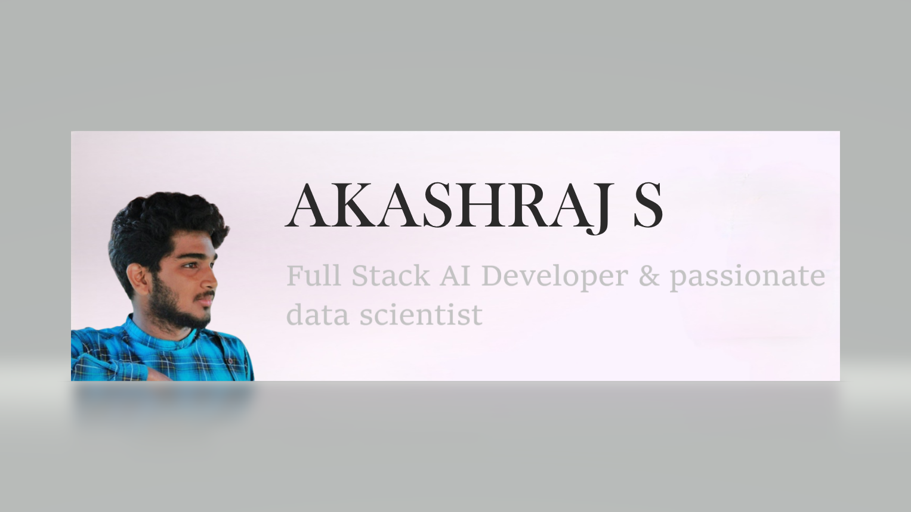

# Hi, I'm Akashraj S👋🏾 👩🏾‍💻

### :space_invader: &nbsp;About Me

🚀 **Full Stack AI Developer** at [Edsols](https://www.edsols.in/)
  
🌱 **Passionate** about Data Science and innovation.

💓 **Dedicated** to problem solving and daily routines automation.

✍️ Currently on a mission to transform Raw Data into Actionable Insights, specializing in inertial sensors and sensor fusion. 💡 

🔧 Coding since 2019. Let's embark on a journey of discovery together! 🌟

  &nbsp;&nbsp;&nbsp;&nbsp;
  &nbsp;&nbsp;&nbsp;&nbsp;
  &nbsp;&nbsp;&nbsp;&nbsp;

  
<b>:computer: &nbsp;Main tech knowledge</b>

   

&nbsp;
&nbsp;\
&nbsp;
&nbsp;
&nbsp;
&nbsp;
&nbsp;

&nbsp;
&nbsp;

&nbsp;
&nbsp;

<!-- 
Java, JSF, Primefaces, Angular, Spring, Springboot, JPA/Hibernate. 
Flutter, GetX, BLoC, MobX.
GitHub, GitLab, Docker, Ansible
Kotlin, Firebase.
Ant, Maven, Gradle, 
VSCode, Eclipse, IntelliJ IDEA.
HTML, CSS, JavaScript, TypeScript.
postgresql, pgadmin, mysql, sqlite.
TDD, BDD, DDD
clean architecture, hexagonal architecture, onion architecture, mvc, mvvm.
linux
-->

<!-- 
jquery, sass
nestjs, nodejs, redis, nginx,
rest, graphql, grpc
apache kafka,
google cloud plataform, google app engine, aws
oracle, mariadb, mongodb, 
Kubernates, puppet, github actions
python, c, cpp, arduino
php, photoshop
blockchain, cryptocurrencies, cryptography, bitcoin, ethereum 
-->

  
<b>:brain: &nbsp;Other knowledge, always learning</b>

   

&nbsp;
&nbsp;
&nbsp;
&nbsp;
&nbsp;

  
<b>:gear: &nbsp;GitHub Statistics</b>

   
    

        
    

    

         
    

